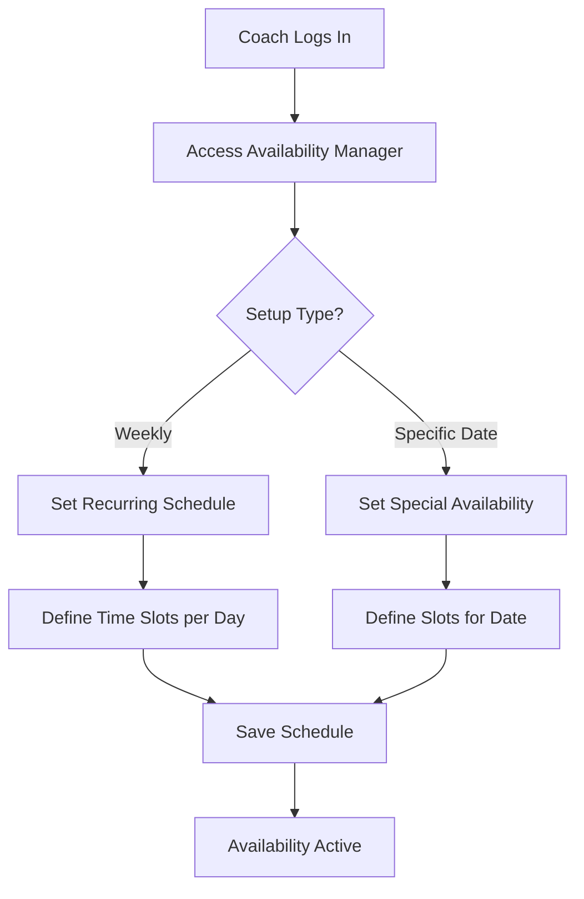
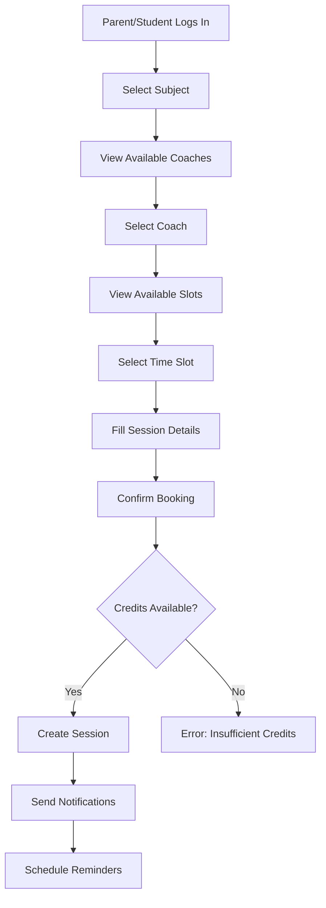
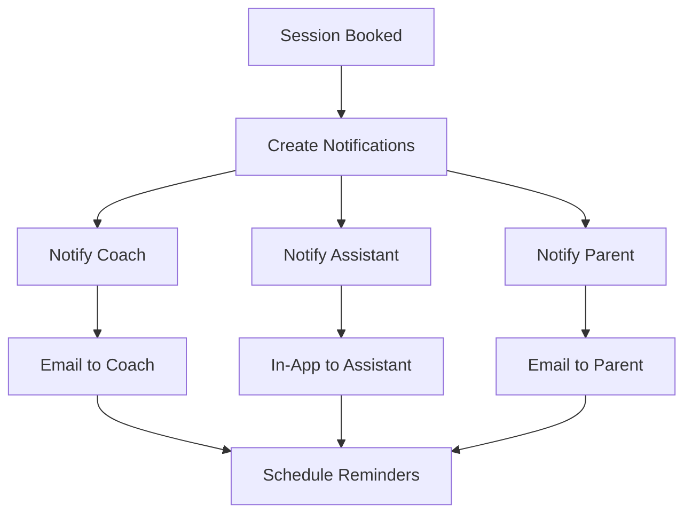
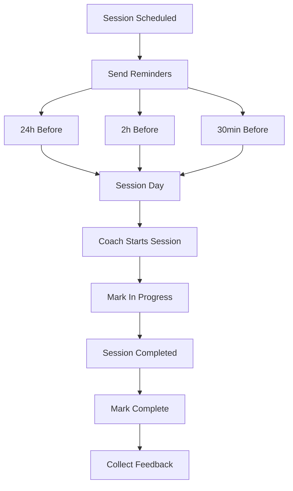

# 📚 Session Booking Logic - Nexus Réussite

## 🎯 **Overview**

The session booking system provides a comprehensive workflow that allows coaches to set their availability, students/parents to book sessions, and assistants to monitor all activities. The system includes real-time notifications, automatic reminders, and credit management.

## 🏗️ **System Architecture**

### **Database Schema**

#### **1. CoachAvailability Model**
- **Purpose**: Stores coach availability schedules (weekly recurring + specific dates)
- **Key Fields**: 
  - `dayOfWeek` (0-6, Sunday-Saturday)
  - `startTime`, `endTime` (HH:MM format)
  - `isRecurring` (weekly pattern vs specific date)
  - `specificDate` (for holidays, special availability)
  - `isAvailable` (active/inactive slots)

#### **2. SessionBooking Model**
- **Purpose**: Core session management with full lifecycle tracking
- **Key Fields**:
  - Participants: `studentId`, `coachId`, `parentId`
  - Scheduling: `scheduledDate`, `startTime`, `endTime`, `duration`
  - Status: `SCHEDULED`, `CONFIRMED`, `IN_PROGRESS`, `COMPLETED`, `CANCELLED`
  - Details: `subject`, `type`, `modality`, `creditsUsed`
  - Feedback: `rating`, `feedback`, `coachNotes`, `studentNotes`

#### **3. SessionNotification Model**
- **Purpose**: Multi-channel notification system
- **Types**: `SESSION_BOOKED`, `SESSION_REMINDER`, `SESSION_CANCELLED`, etc.
- **Methods**: `EMAIL`, `SMS`, `IN_APP`, `PUSH`

#### **4. SessionReminder Model**
- **Purpose**: Automated reminder scheduling
- **Types**: `ONE_DAY_BEFORE`, `TWO_HOURS_BEFORE`, `THIRTY_MINUTES_BEFORE`

## 🔄 **Complete Workflow**

### **Phase 1: Coach Availability Setup**



**Coach Actions:**
1. **Weekly Schedule**: Set recurring availability for each day of the week
2. **Specific Dates**: Override weekly schedule for holidays, special events
3. **Time Slot Management**: Add/remove/modify individual time slots
4. **Bulk Operations**: Copy schedules between days, set default patterns

### **Phase 2: Session Discovery & Booking**



**Booking Process:**
1. **Subject Selection**: Choose from available subjects
2. **Coach Discovery**: View coaches qualified for the subject
3. **Availability Check**: Real-time slot availability
4. **Session Configuration**: Type, modality, description
5. **Credit Validation**: Automatic credit deduction
6. **Confirmation**: Instant booking with notifications

### **Phase 3: Notification System**



**Notification Recipients:**
- **Coach**: Email notification with session details
- **Assistant**: In-app notification for monitoring
- **Parent**: Email confirmation (if different from booker)
- **Student**: In-app notification

### **Phase 4: Session Management**



## 🛠️ **API Endpoints**

### **Coach Availability Management**

#### **POST /api/coaches/availability**
Set weekly or specific date availability
```json
{
  "type": "weekly",
  "schedule": [
    {
      "dayOfWeek": 1,
      "slots": [
        {
          "startTime": "09:00",
          "endTime": "10:00",
          "isAvailable": true
        }
      ]
    }
  ]
}
```

#### **GET /api/coaches/availability**
Get coach availability for date range
```
?coachId=xxx&startDate=2024-01-01&endDate=2024-01-07
```

### **Session Booking**

#### **POST /api/sessions/book**
Book a new session
```json
{
  "coachId": "xxx",
  "studentId": "xxx",
  "subject": "MATHEMATIQUES",
  "scheduledDate": "2024-01-15",
  "startTime": "14:00",
  "endTime": "15:00",
  "duration": 60,
  "title": "Révision équations",
  "creditsToUse": 1
}
```

#### **GET /api/sessions**
Get user's sessions
```
?userId=xxx&status=SCHEDULED&startDate=2024-01-01
```

#### **PATCH /api/sessions/{id}/status**
Update session status
```json
{
  "status": "COMPLETED",
  "notes": "Excellent progress"
}
```

## 🎨 **Frontend Components**

### **1. SessionBooking Component**
- **Purpose**: Complete booking flow for parents/students
- **Features**: 
  - Subject and coach selection
  - Real-time availability checking
  - Multi-step booking wizard
  - Credit validation and usage
  - Responsive design for all devices

### **2. CoachAvailability Component**
- **Purpose**: Availability management for coaches
- **Features**:
  - Weekly schedule editor
  - Specific date override
  - Bulk operations (copy, default, clear)
  - Time slot validation
  - Visual schedule representation

### **3. SessionManager Component**
- **Purpose**: Session oversight for assistants
- **Features**:
  - Real-time session monitoring
  - Status updates and notes
  - Notification management
  - Performance analytics

## 📱 **Responsive Design Features**

### **Mobile Optimization**
- **Touch-friendly**: Large buttons and tap targets
- **Readable**: Responsive typography and spacing
- **Navigation**: Mobile-first navigation patterns
- **Forms**: Optimized input fields and selectors

### **Tablet Support**
- **Grid Layouts**: Adaptive column layouts
- **Touch Interface**: Gesture-friendly interactions
- **Screen Space**: Efficient use of available space

### **Desktop Enhancement**
- **Multi-column**: Rich layouts with detailed views
- **Keyboard**: Full keyboard navigation support
- **Advanced Features**: Drag-and-drop, bulk operations

## 🔔 **Notification System**

### **Immediate Notifications**
- **Session Booked**: Instant confirmation to all parties
- **Session Cancelled**: Immediate cancellation notice
- **Status Changes**: Real-time status updates

### **Scheduled Reminders**
- **24 Hours Before**: Initial reminder with session details
- **2 Hours Before**: Preparation reminder
- **30 Minutes Before**: Final reminder with meeting links

### **Delivery Methods**
- **Email**: Detailed notifications with calendar attachments
- **In-App**: Real-time dashboard notifications
- **SMS**: Critical reminders and confirmations
- **Push**: Mobile app notifications

## 🏆 **Key Features**

### **For Coaches**
- ✅ Flexible availability management
- ✅ Automatic conflict detection
- ✅ Session status tracking
- ✅ Student feedback collection
- ✅ Revenue and performance analytics

### **For Parents/Students**
- ✅ Easy coach discovery
- ✅ Real-time availability
- ✅ Credit management
- ✅ Session history
- ✅ Feedback and ratings

### **For Assistants**
- ✅ Complete oversight dashboard
- ✅ Real-time monitoring
- ✅ Performance analytics
- ✅ Issue resolution tools
- ✅ Communication management

## 🔒 **Security & Validation**

### **Access Control**
- **Role-based**: Strict role-based access control
- **Session Ownership**: Users can only access their sessions
- **Coach Subjects**: Validation of coach qualifications

### **Data Validation**
- **Time Conflicts**: Automatic conflict detection
- **Credit Limits**: Real-time credit validation
- **Availability**: Dynamic availability checking
- **Business Rules**: Comprehensive business logic validation

## 🚀 **Performance Optimizations**

### **Database**
- **Indexing**: Strategic database indexes for performance
- **Caching**: Redis caching for frequently accessed data
- **Transactions**: Atomic operations for data consistency

### **Frontend**
- **Lazy Loading**: Component-based code splitting
- **Optimistic Updates**: Immediate UI feedback
- **Real-time**: WebSocket connections for live updates
- **Responsive**: Mobile-first responsive design

## 📈 **Analytics & Reporting**

### **Session Metrics**
- Booking conversion rates
- Coach utilization rates
- Student engagement metrics
- Revenue per session

### **Performance Tracking**
- System response times
- Error rates and resolution
- User satisfaction scores
- Feature adoption rates

This comprehensive session booking system provides a seamless experience for all users while maintaining high performance, security, and reliability standards. 