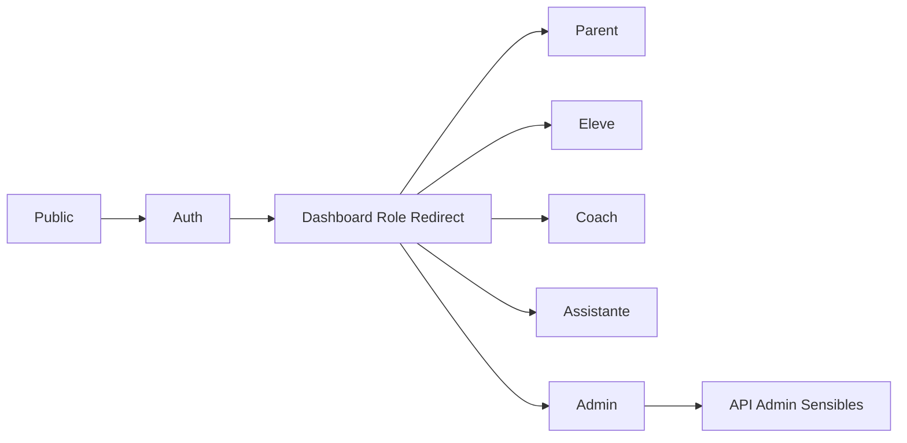

# Carte Du Site (Factuelle)

## Périmètre mesuré
Source automatique: `docs/_generated/routes.json`.

- Pages détectées: `69`
- Routes API détectées: `74`
- Pages dashboard/admin: `30`
- API admin sensibles détectées: `13`

Preuves code:
- `scripts/docs/route_inventory.js` (génération inventaire)
- `docs/_generated/routes.json`

## Schéma global (Public / Auth / Dashboards / Admin)

## Segments pages
| Segment | Exemples routes |
|---|---|
| Public | `/`, `/offres`, `/bilan-gratuit`, `/bilan-pallier2-maths`, `/stages/fevrier-2026` |
| Auth | `/auth/signin`, `/auth/mot-de-passe-oublie`, `/auth/reset-password`, `/auth/activate` |
| Dashboards | `/dashboard/parent`, `/dashboard/eleve`, `/dashboard/coach`, `/dashboard/assistante` |
| Admin | `/dashboard/admin`, `/dashboard/admin/users`, `/dashboard/admin/analytics`, `/admin/directeur` |

Preuves code:
- `app/auth/signin/page.tsx`
- `app/dashboard/page.tsx`
- `middleware.ts` (maps `roleRouteMap`, `rolePrefixMap`)

## Dashboards par rôle
| Rôle | Routes |
|---|---|
| `PARENT` | `/dashboard/parent`, `/dashboard/parent/abonnements`, `/dashboard/parent/paiement/*` |
| `ELEVE` | `/dashboard/eleve`, `/dashboard/eleve/mes-sessions`, `/dashboard/eleve/ressources` |
| `COACH` | `/dashboard/coach` |
| `ASSISTANTE` | `/dashboard/assistante`, `/dashboard/assistante/subscription-requests`, `/dashboard/assistante/credit-requests` |
| `ADMIN` | `/dashboard/admin`, `/dashboard/admin/users`, `/dashboard/admin/subscriptions`, `/dashboard/admin/facturation` |

Preuves code:
- `docs/_generated/routes.json` (`dashboardsByRole`)

## Inventaire API (synthèse)
| Groupe | Exemples |
|---|---|
| Auth | `/api/auth/[...nextauth]`, `/api/auth/reset-password`, `/api/student/activate` |
| Diagnostics/Bilans | `/api/bilan-gratuit`, `/api/bilan-pallier2-maths`, `/api/bilan-pallier2-maths/retry`, `/api/assessments/submit` |
| Sessions/Réservation | `/api/sessions/book`, `/api/sessions/cancel`, `/api/sessions/video`, `/api/reservation` |
| Paiements/Abonnements | `/api/payments/konnect`, `/api/payments/wise`, `/api/subscriptions/change`, `/api/parent/subscriptions` |
| Admin sensible | `/api/admin/users`, `/api/admin/subscriptions`, `/api/admin/invoices`, `/api/admin/recompute-ssn`, `/api/admin/analytics` |

Preuves code:
- `docs/_generated/routes.json` (`apiRoutes`, `sensitiveAdminApi`)

## API admin sensibles (extrait)
| Endpoint | Méthodes | Fichier |
|---|---|---|
| `/api/admin/users` | `GET POST PATCH DELETE` | `app/api/admin/users/route.ts` |
| `/api/admin/subscriptions` | `GET PUT` | `app/api/admin/subscriptions/route.ts` |
| `/api/admin/invoices` | `GET POST` | `app/api/admin/invoices/route.ts` |
| `/api/admin/invoices/[id]` | `PATCH` | `app/api/admin/invoices/[id]/route.ts` |
| `/api/admin/recompute-ssn` | `POST` | `app/api/admin/recompute-ssn/route.ts` |
| `/api/admin/analytics` | `GET` | `app/api/admin/analytics/route.ts` |

## Redirections structurelles
- `/inscription` -> `/bilan-gratuit` (307)
- `/questionnaire` -> `/bilan-gratuit` (307)
- `/tarifs` -> `/offres` (307)

Preuves code:
- `next.config.mjs` (`redirects()`)

> **ATTENTION**
> Toute nouvelle route doit être suivie d’une régénération inventaire (`docs/README.md`), sinon la doc dérive.
