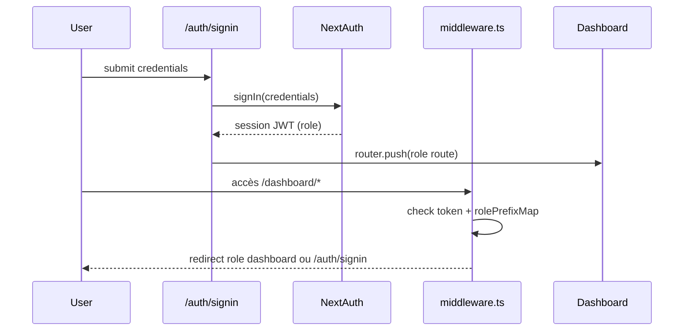
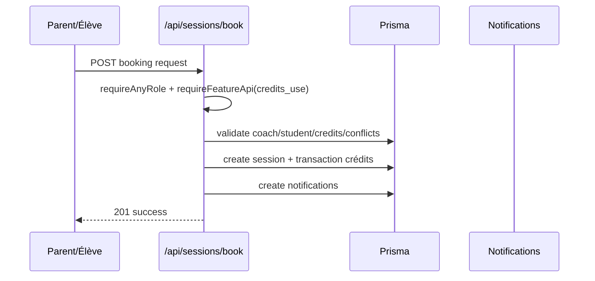

# Guide De Navigation (Document Central)

## 1) Entrer sur Nexus
Entrées principales:
- Landing: `/`
- Pages d’acquisition: `/offres`, `/accompagnement-scolaire`, `/famille`, `/contact`
- CTA vers conversion: `/bilan-gratuit`
- Deep links role-based: `/dashboard/*` (redirigé par middleware)

Preuves code:
- `app/page.tsx`
- `app/offres/page.tsx`
- `middleware.ts` (protection `/dashboard`)
- `next.config.mjs` (redirects `/inscription`, `/questionnaire`, `/tarifs`)

```mermaid
flowchart TD
  A[Visiteur] --> B{Point d'entrée}
  B -->|Landing/Offres| C[/bilan-gratuit]
  B -->|Deep link dashboard| D[/dashboard/...]
  D --> E{Session?}
  E -->|Non| F[/auth/signin]
  E -->|Oui| G[Dashboard selon rôle]
```

## 2) Connexion / callback / reset / activation
### Connexion
- Formulaire: `/auth/signin`.
- `signIn("credentials", redirect:false)` puis redirection client par rôle.
- Callback explicite utilisé sur page programme: `/programme/maths-1ere` redirige vers `/auth/signin?callbackUrl=...`.

Preuves code:
- `app/auth/signin/page.tsx` (`handleSubmit`, `signIn`, `roleRoutes`)
- `app/programme/maths-1ere/page.tsx` (`callbackUrl`, `redirect(...)`)

### Reset mot de passe
- Demande reset: `/auth/mot-de-passe-oublie` -> `POST /api/auth/reset-password` avec `{email}`.
- Confirmation reset: `/auth/reset-password?token=...` -> `POST /api/auth/reset-password` avec `{token,newPassword}`.

Preuves code:
- `app/auth/mot-de-passe-oublie/page.tsx`
- `app/auth/reset-password/page.tsx`
- `app/api/auth/reset-password/route.ts` (`handleRequestReset`, `handleConfirmReset`)

### Activation élève
- Lien: `/auth/activate?token=...`.
- Vérification token: `GET /api/student/activate`.
- Activation finale: `POST /api/student/activate`.

Preuves code:
- `app/auth/activate/page.tsx`
- `app/api/student/activate/route.ts`
- `lib/services/student-activation.service.ts` (`initiateStudentActivation`, `completeStudentActivation`)



## 3) Arbre de décision par statut
```mermaid
flowchart TD
  A[Utilisateur] --> B{Connecté ?}
  B -->|Non| C[/auth/signin]
  B -->|Oui| D{Rôle}
  D --> E[ELEVE -> /dashboard/eleve]
  D --> F[PARENT -> /dashboard/parent]
  D --> G[COACH -> /dashboard/coach]
  D --> H[ASSISTANTE -> /dashboard/assistante]
  D --> I[ADMIN -> /dashboard/admin]
  E --> J{Activation/Entitlements OK?}
  J -->|Non| K[/access-required ou erreur 401/403]
```

Preuves code:
- `middleware.ts` (`roleRouteMap`, `rolePrefixMap`)
- `app/dashboard/page.tsx` (switch rôle)
- `lib/access/guard.ts` (`requireFeature`, redirection `/access-required`)

## 4) Parcours par profil
### Visiteur
1. Découverte (`/`, `/offres`).
2. Conversion vers `/bilan-gratuit`.
3. Soumission formulaire -> confirmation -> assessment.

Preuves code:
- `app/bilan-gratuit/page.tsx`
- `app/api/bilan-gratuit/route.ts`

### Inscrit non abonné (parent)
1. Connexion parent.
2. Dashboard parent.
3. Demande abonnement (`/api/parent/subscriptions` ou `/api/parent/subscription-requests`).
4. Paiement (`/api/payments/konnect`, `/api/payments/wise`).

Preuves code:
- `app/dashboard/parent/abonnements/page.tsx`
- `app/api/parent/subscriptions/route.ts`
- `app/api/payments/konnect/route.ts`
- `app/api/payments/wise/route.ts`

### Parent abonné
1. Dashboard parent -> suivi enfant.
2. Réservation session (`/api/sessions/book`).
3. Facturation (`/api/invoices/[id]/pdf`, `/api/invoices/[id]/receipt/pdf`).

### Élève
1. Dashboard élève.
2. Session de diagnostic/assessment.
3. Résultats et ressources.

Preuves code:
- `app/dashboard/eleve/page.tsx`
- `app/api/student/dashboard/route.ts`
- `app/api/assessments/*`

### Coach
1. Dashboard coach.
2. Gestion disponibilités.
3. Soumission rapport séance.

Preuves code:
- `app/dashboard/coach/page.tsx`
- `app/api/coaches/availability/route.ts`
- `app/api/coach/sessions/[sessionId]/report/route.ts`

### Assistante
1. Dashboard assistante.
2. Traitement demandes abonnements/crédits.
3. Opérations étudiants/coachs.

Preuves code:
- `app/dashboard/assistante/page.tsx`
- `app/api/assistant/subscription-requests/route.ts`
- `app/api/assistant/credit-requests/route.ts`

### Admin
1. Dashboard admin.
2. Users/subscriptions/invoices/analytics.
3. Endpoints sensibles (`recompute-ssn`, `directeur/stats`).

Preuves code:
- `app/dashboard/admin/page.tsx`
- `app/api/admin/users/route.ts`
- `app/api/admin/invoices/route.ts`
- `app/api/admin/recompute-ssn/route.ts`

## 5) Cas limites (error paths)
- `401` non authentifié: routes API avec `getServerSession`/guards.
- `403` rôle insuffisant: middleware dashboards + guards API.
- Session expirée: redirection `/auth/signin`.
- Entitlement manquant: page `/access-required`.

Preuves code:
- `middleware.ts`
- `lib/guards.ts`
- `lib/access/guard.ts`
- `app/access-required/page.tsx`

> **ERREUR**
> Si un utilisateur authentifié tente un dashboard d’un autre rôle, `middleware.ts` le redirige vers son dashboard natif (sauf `ADMIN` qui a override).

## 6) Workflow clé (réservation session)


Preuves code:
- `app/api/sessions/book/route.ts` (`requireAnyRole`, `requireFeatureApi`, transaction)
