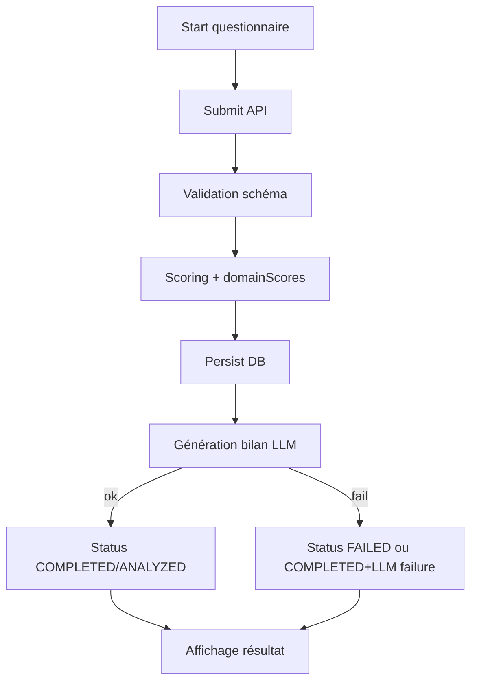
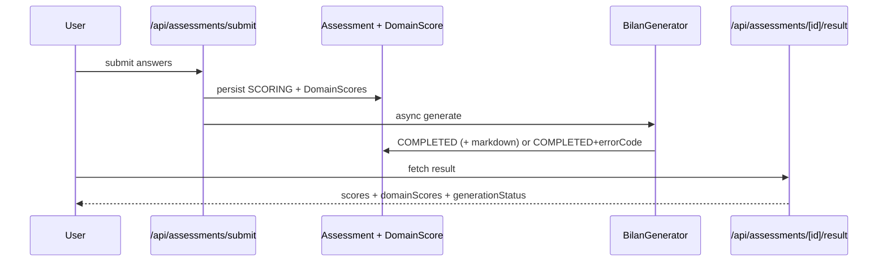

# Guide Questionnaires Et Bilans

## Flux global

Preuves code:
- `app/api/assessments/submit/route.ts`
- `app/api/assessments/[id]/result/route.ts`
- `app/api/bilan-pallier2-maths/route.ts`
- `app/api/bilan-pallier2-maths/retry/route.ts`

## Workflow A: Assessment universel (`/api/assessments/*`)
- Submit: `POST /api/assessments/submit`.
- Statut polling: `GET /api/assessments/[id]/status`.
- Résultat final: `GET /api/assessments/[id]/result`.

Champs clés exposés:
- `status` (`PENDING | SCORING | GENERATING | COMPLETED | FAILED`) — modèle `Assessment`.
- `domainScores`.
- `generationStatus` (`COMPLETE | FAILED | PENDING`) dans la réponse result.
- `errorCode`, `retryCount`.
- `llmUnavailableMessage` si échec LLM sans bilans.

Preuves code:
- `prisma/schema.prisma` (enum `AssessmentStatus`, champs `errorCode`, `retryCount`, relation `domainScores`)
- `app/api/assessments/[id]/result/route.ts` (construction `generationStatus`, `llmUnavailableMessage`)
- `lib/assessments/generators/index.ts` (P0: status `COMPLETED` même si LLM KO)

## Workflow B: Diagnostic pré-stage (`/api/bilan-pallier2-maths`)
- Submit: `POST /api/bilan-pallier2-maths`.
- Retry staff: `POST /api/bilan-pallier2-maths/retry`.
- Accès public sécurisé: `?share=` ou token signé `?t=`.

Statuts pipeline (Diagnostic):
- `RECEIVED -> VALIDATED -> SCORED -> GENERATING -> ANALYZED -> FAILED`.
- Retour API inclut `status`, `publicShareId`, tokens audience signés.
- En échec LLM: `errorCode` (`OLLAMA_TIMEOUT`, `OLLAMA_EMPTY_RESPONSE`, `UNKNOWN_ERROR`) et fallback template.

Preuves code:
- `prisma/schema.prisma` (model `Diagnostic`, champs `status`, `errorCode`, `retryCount`, `studentMarkdown/parentsMarkdown/nexusMarkdown`)
- `app/api/bilan-pallier2-maths/route.ts`
- `app/api/bilan-pallier2-maths/retry/route.ts`

## Résilience LLM/RAG (obligatoire)
- L’échec LLM ne bloque pas l’accès aux scores.
- Fallback bilans template côté diagnostic.
- Message explicite indisponibilité IA côté assessments.

Preuves code:
- `lib/bilan-generator.ts` (`generateFallbackBilans`)
- `lib/assessments/generators/index.ts` (catch -> `COMPLETED` + `LLM_GENERATION_FAILED`)
- `app/api/assessments/[id]/result/route.ts`

> **NOTE**
> `generationStatus` est exposé sur le pipeline `Assessment` (API result), pas comme champ DB natif.
