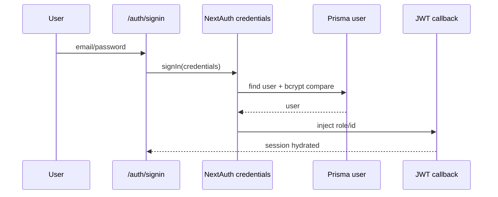

# Authentification

## Architecture
- Stack: NextAuth v4 + `CredentialsProvider` + `PrismaAdapter`.
- Session strategy: `jwt`.
- Page signin custom: `/auth/signin`.

Preuves code:
- `lib/auth.ts` (`authOptions`, `providers`, `session.strategy='jwt'`, `pages.signIn`)
- `app/api/auth/[...nextauth]/route.ts`

## Entrées auth couvertes
- `/auth/signin`
- `/auth/mot-de-passe-oublie`
- `/auth/reset-password?token=...`
- `/auth/activate?token=...`
- `/api/auth/reset-password`
- `/api/student/activate`

Preuves code:
- `app/auth/signin/page.tsx`
- `app/auth/mot-de-passe-oublie/page.tsx`
- `app/auth/reset-password/page.tsx`
- `app/auth/activate/page.tsx`
- `app/api/auth/reset-password/route.ts`
- `app/api/student/activate/route.ts`

## États gérés
- Non inscrit/non connecté: redirection signin sur dashboards (`middleware.ts`).
- Étudiant non activé: login bloqué (`authorize` retourne `null`).
- Session expirée/absente: `401` API ou redirection `/auth/signin`.
- Reset token invalide/expiré: `400` reset API.
- Activation token invalide/expiré: `{valid:false}` ou `400`.

Preuves code:
- `lib/auth.ts` (bloc `if (user.role === 'ELEVE' && !user.activatedAt)`)
- `middleware.ts`
- `app/api/auth/reset-password/route.ts`
- `lib/services/student-activation.service.ts`

## callbackUrl
- Utilisé explicitement sur `/programme/maths-1ere`.
- Middleware dashboard redirige vers signin sans callback attaché.

Preuves code:
- `app/programme/maths-1ere/page.tsx`
- `middleware.ts`

## Sécurité auth / CSRF / cookies
- CSRF origin-check sur méthodes mutantes via `checkCsrf`.
- Origines autorisées prod+dev: `https://nexusreussite.academy`, `NEXT_PUBLIC_APP_URL`, `NEXTAUTH_URL`, localhost/127.0.0.1 en non-prod.
- Cookies/session NextAuth gérés par NextAuth; URL canonique via `NEXTAUTH_URL`.
- `NEXTAUTH_SECRET` obligatoire en prod (sinon throw).

Preuves code:
- `lib/csrf.ts` (`getAllowedOrigins`, `checkCsrf`)
- `lib/auth.ts` (`generateSecret`, exception prod)
- `lib/env-validation.ts` (`NEXTAUTH_SECRET`, `NEXTAUTH_URL` requis prod)

> **ATTENTION**
> Aucun flag explicite `trustHost` n’est défini dans `authOptions`; le comportement repose sur la config NextAuth standard + `NEXTAUTH_URL`.
