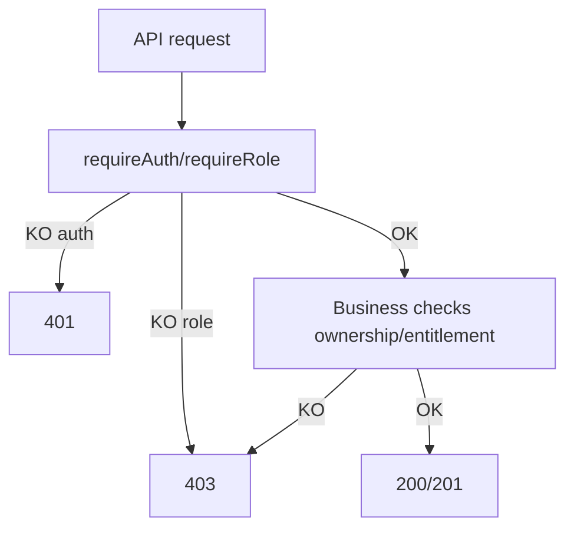

# RBAC Matrice

## Source de vérité
- Permissions/Policies: `lib/rbac.ts`
- Guards API: `lib/guards.ts`
- Guard entitlements: `lib/access/guard.ts`
- Enforcement dashboard: `middleware.ts`
- Inventaire auto: `docs/_generated/rbac_matrix.json`, `docs/_generated/routes.json`

## Matrice rôles x actions (synthèse)
| Rôle | Portée dominante |
|---|---|
| `ADMIN` | `MANAGE` global (users/students/bilans/sessions/paiements/subscriptions/config) |
| `ASSISTANTE` | opérations staff (coachs, crédits, subscriptions, validation demandes) |
| `COACH` | dashboard coach, disponibilités, rapports sessions |
| `PARENT` | enfants, abonnements, demandes, paiements, réservations |
| `ELEVE` | dashboard élève, sessions, crédits, ressources, ARIA (si entitlement) |

Preuve code:
- `lib/rbac.ts` (const `rolePermissions`, `RBAC_POLICIES`)

## Matrice endpoints sensibles (extrait)
| Endpoint | Rôle requis (code) | Preuve test |
|---|---|---|
| `/api/admin/dashboard` | `ADMIN` (`requireRole(UserRole.ADMIN)`) | `__tests__/api/admin.dashboard.route.test.ts` |
| `/api/admin/analytics` | `ADMIN` | `__tests__/api/admin.analytics.route.test.ts` |
| `/api/admin/activities` | `ADMIN` | `__tests__/api/admin.activities.route.test.ts` |
| `/api/admin/users` | `ADMIN` | `__tests__/api/admin-users.test.ts` |
| `/api/admin/subscriptions` | `ADMIN` | `__tests__/api/admin.subscriptions.route.test.ts` |
| `/api/admin/test-email` | `ADMIN` | `__tests__/api/admin.test-email.route.test.ts` |
| `/api/admin/test-payments` | `ADMIN` | `__tests__/api/admin.test-payments.route.test.ts` |
| `/api/payments/konnect` | `PARENT` (`requireRole`) | `__tests__/api/payments-konnect.test.ts` |
| `/api/coach/sessions/[sessionId]/report` | `COACH` + ownership | `__tests__/api/coach.session-report.route.test.ts` |
| `/api/assistant/subscription-requests` | `ASSISTANTE` | `__tests__/api/assistant.subscription-requests.route.test.ts` |

## Contrôles 401/403/200
- `401` non authentifié via `requireAuth`/`requireRole`.
- `403` rôle insuffisant via `requireRole`/`requireAnyRole`.
- `200`/`201` chemin nominal quand rôle et ownership satisfaits.

Preuves code:
- `lib/guards.ts` (`requireAuth`, `requireRole`, `requireAnyRole`)
- `__tests__/api/payments-konnect.test.ts` (cas `401`, `403`, succès)
- `__tests__/api/coach.session-report.route.test.ts` (cas `401`, `403`, succès)
- `e2e/qa-auth-workflows.spec.ts` (guards dashboard + API)



## Pages protégées
- Dashboards: `/dashboard/*` via middleware.
- Accès croisé interdit sauf `ADMIN`.

Preuves code:
- `middleware.ts` (`rolePrefixMap`, exception `ADMIN`)

> **NOTE**
> `docs/_generated/rbac_matrix.json` fournit l’extraction des policies déclarées dans `lib/rbac.ts`.

## Audit P0 couverture tests (strict)
Source automatique: `docs/_generated/rbac_coverage.json`.

- Endpoints admin sensibles: `13`
- Couverts par au moins un test: `10`
- Manquants: `3`

Endpoints admin sensibles sans preuve de test détectée:
- `/api/admin/invoices` (`GET`, `POST`) — `app/api/admin/invoices/route.ts`
- `/api/admin/invoices/[id]` (`PATCH`) — `app/api/admin/invoices/[id]/route.ts`
- `/api/admin/invoices/[id]/send` (`POST`) — `app/api/admin/invoices/[id]/send/route.ts`

```mermaid
flowchart LR
  A[Admin sensitive endpoints] --> B[13 total]
  B --> C[10 covered]
  B --> D[3 missing]
  D --> E[/api/admin/invoices]
  D --> F[/api/admin/invoices/[id]]
  D --> G[/api/admin/invoices/[id]/send]
```
