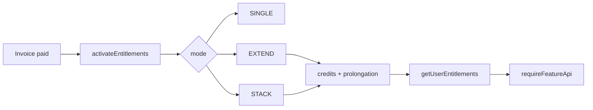

# Entitlements Et Abonnements

## Définition opérationnelle
Un entitlement est un droit d’accès activé par produit (`productCode`) et rattaché au bénéficiaire (`beneficiaryUserId`).

Preuves code:
- `lib/entitlement/types.ts` (`PRODUCT_REGISTRY`, `ProductCode`, `features`)
- `lib/entitlement/engine.ts` (`activateEntitlements`, `suspendEntitlements`)

## Modes d’activation
- `SINGLE`: noop si déjà actif.
- `EXTEND`: prolonge `endsAt` si actif, sinon crée.
- `STACK`: crée systématiquement, cumule crédits.

Preuve code:
- `lib/entitlement/engine.ts` (branches `product.mode`)

## Cas métier demandés
### Inscrit non abonné
- Peut avoir compte/session mais pas les features payantes.
- Gating via `requireFeatureApi` et `resolveAccess`.

Preuves code:
- `lib/access/rules.ts`
- `lib/access/guard.ts`
- `app/api/sessions/book/route.ts` (`requireFeatureApi('credits_use')`)

### Abonné
- Entitlements actifs créés/étendus après paiement facture (`MARK_PAID` flow facture).
- Peut débloquer crédits (`grantsCredits`) + features.

Preuves code:
- `app/api/admin/invoices/[id]/route.ts` (appel `activateEntitlements`)
- `lib/entitlement/engine.ts`

### Admin bypass
- Bypass entitlement explicite par `rolesExempt` selon feature.
- Exemples: `platform_access` exempte `ADMIN`, `ASSISTANTE`, `COACH`.

Preuves code:
- `lib/access/features.ts` (`rolesExempt`)
- `lib/access/rules.ts` (branche `feature.rolesExempt.includes(role)`)

> **ATTENTION**
> Sans `beneficiaryUserId` sur facture: 0 entitlement activé (fallback sûr, pas d’erreur fatale).
