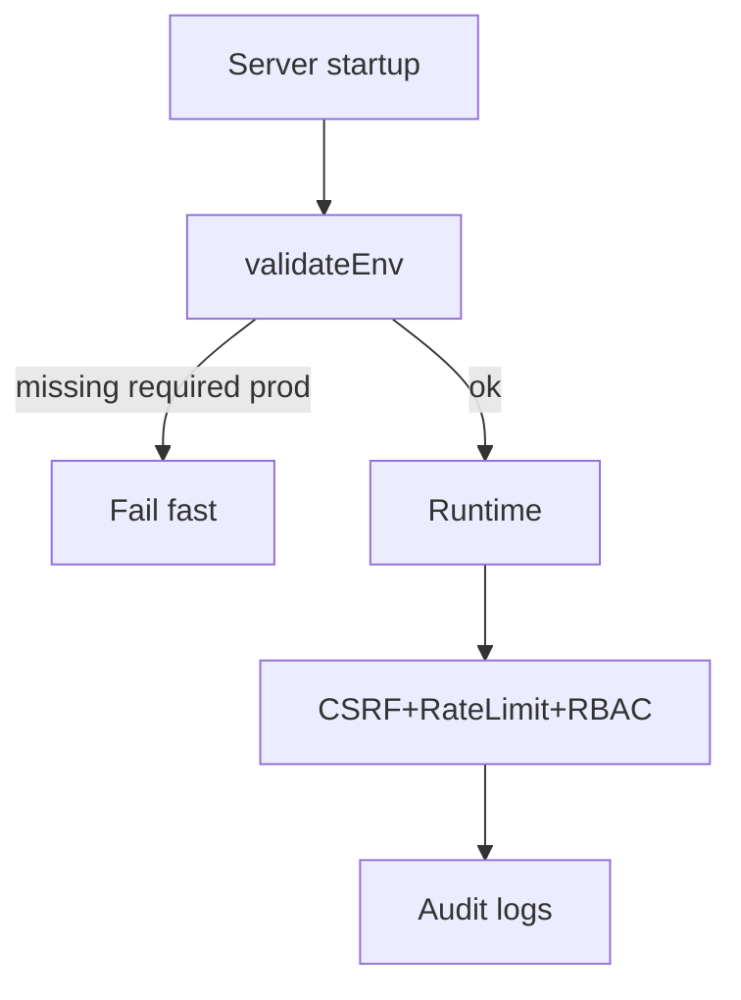

# Sécurité Et Conformité

## Données sensibles et traitements
- Mot de passe: hash bcrypt (`bcrypt.compare`, `bcrypt.hash(...,12)`).
- Tokens reset/activation: signés/hashés + expiration.
- SSN/indices diagnostics: stockés DB, recalcul admin dédié.

Preuves code:
- `lib/auth.ts`
- `app/api/auth/reset-password/route.ts`
- `lib/services/student-activation.service.ts`
- `app/api/admin/recompute-ssn/route.ts`

## Contrôles techniques
- CSRF same-origin sur routes mutantes.
- Rate limiting (Upstash, fail-open contrôlé, warning prod si absent).
- Headers de sécurité (HSTS, CSP, XFO, etc.) au middleware.
- Limite body size (413) sur endpoints protégés.

Preuves code:
- `lib/csrf.ts`
- `lib/rate-limit.ts`
- `middleware.ts` (`applySecurityHeaders`)

## Logs et minimisation
- Logs d’auth avec masquage email.
- Logs diagnostics PII-safe (`safeDiagnosticLog` / `safeSubmissionLog`).

Preuves code:
- `lib/auth.ts`
- `app/api/bilan-pallier2-maths/route.ts`

## Secrets / env contract
- Required prod: `DATABASE_URL`, `NEXTAUTH_SECRET`, `NEXTAUTH_URL`.
- Recommended: `OLLAMA_URL`, `RAG_INGESTOR_URL`, `SMTP_*`, `KONNECT_API_KEY`, `TELEGRAM_BOT_TOKEN`.
- Validation au boot via instrumentation hook.

Preuves code:
- `lib/env-validation.ts`
- `instrumentation.ts`

## Conformité opérationnelle

> **ERREUR**
> En prod, absence `NEXTAUTH_SECRET` déclenche une erreur bloquante (`lib/auth.ts`), et variables required manquantes déclenchent un fail-fast (`lib/env-validation.ts`).
