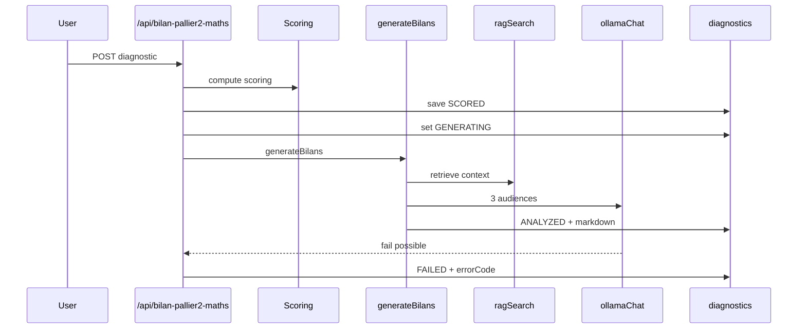

# LLM / RAG Pipeline

## Contrat LLM_MODE
- `LLM_MODE=live` (défaut)
- `LLM_MODE=stub`
- `LLM_MODE=off`

Preuves code:
- `lib/assessments/generators/index.ts` (`getLlmMode`, commentaire contractuel)
- `lib/env-validation.ts` (`LLM_MODE` optionnel, description)

### Effets runtime
- `live`: appel Ollama réel.
- `stub`: bilans déterministes pour tests/staging.
- `off`: pas de génération; assessment marqué `COMPLETED` avec `errorCode=LLM_GENERATION_SKIPPED`.

Preuves code:
- `lib/assessments/generators/index.ts` (branches `llmMode`)

> **ATTENTION**
> Off/stub doivent être activés uniquement par variable d’environnement (CI/E2E/staging). Le défaut code est `live`.

## Endpoints LLM/RAG (env-first)
- Ollama URL: `OLLAMA_URL`, fallback prod `http://ollama:11434`, fallback dev `http://localhost:11434`.
- RAG URL: `RAG_INGESTOR_URL`, fallback prod `http://ingestor:8001`, fallback dev `http://localhost:8001`.

Preuves code:
- `lib/ollama-client.ts` (`getOllamaUrl`)
- `lib/rag-client.ts` (`getIngestorUrl`)

## Pipeline bilan (diagnostic)

Preuves code:
- `app/api/bilan-pallier2-maths/route.ts`
- `lib/bilan-generator.ts`
- `lib/rag-client.ts`
- `lib/ollama-client.ts`

## Stratégie de dégradation
- Diagnostic: fallback template (`generateFallbackBilans`) + statut `FAILED` + message explicite.
- Assessment: en cas échec LLM, résultat reste consommable (`COMPLETED`) avec `generationStatus` et message indisponibilité.

Preuves code:
- `lib/bilan-generator.ts`
- `lib/assessments/generators/index.ts`
- `app/api/assessments/[id]/result/route.ts`

## Champs DB / API à suivre
- Diagnostic: `status`, `errorCode`, `retryCount`, `studentMarkdown`, `parentsMarkdown`, `nexusMarkdown`, `ragUsed`, `ragCollections`.
- Assessment: `status`, `errorCode`, `retryCount`, `domainScores`, `studentMarkdown`, `parentsMarkdown`, `nexusMarkdown`.

Preuves code:
- `prisma/schema.prisma` (models `Diagnostic`, `Assessment`)
