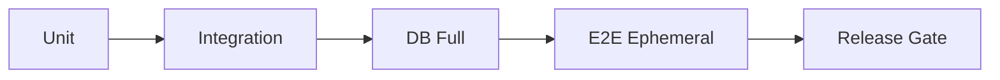

# QA Et Tests

## Commandes officielles
| Couche | Commande |
|---|---|
| Unit | `npm run test:unit` |
| Integration | `npm run test:integration` |
| DB full | `npm run test:db:full` |
| E2E ephemeral | `npm run test:e2e:ephemeral` |
| Full suite | `npm run test:all` |

Preuve code:
- `package.json` (`scripts`)

## Ce que chaque couche couvre
- Unit: logique locale (guards, scorers, utils).
- Integration: routes API + interactions composants serveur.
- DB full: migrations + assertions DB.
- E2E ephemeral: stack Docker dédiée (postgres + app + playwright), flux bout-en-bout.

Preuves code:
- `__tests__/api/*.test.ts`
- `docker-compose.e2e.yml`
- `scripts/e2e-entrypoint.sh`
- `e2e/*.spec.ts`

## Focus RBAC / Auth prouvés
- Guards dashboard/API: `e2e/qa-auth-workflows.spec.ts`.
- Admin API: tests dédiés `__tests__/api/admin.*`.
- Cas 401/403/200: route-level tests (`payments-konnect`, `coach.session-report`, etc.).

## Exécution locale reproductible
```bash
npm run test:unit
npm run test:integration
npm run test:db:full
npm run test:e2e:ephemeral
```



> **NOTE**
> Ce document décrit les commandes et leur couverture. Il n’atteste pas, à lui seul, d’un résultat d’exécution; les logs CI/runtime doivent être conservés séparément.
