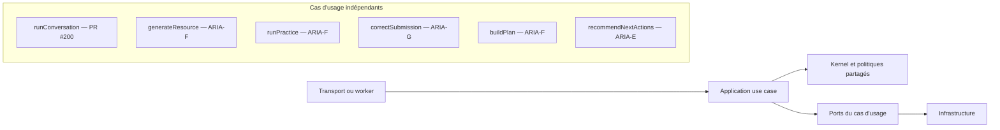
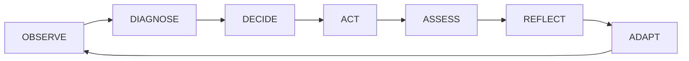
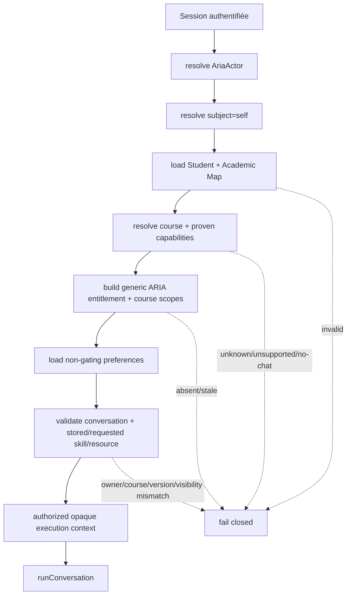
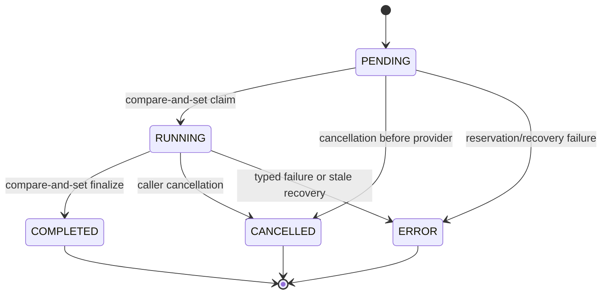
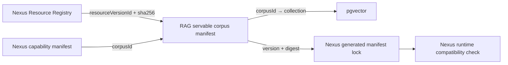
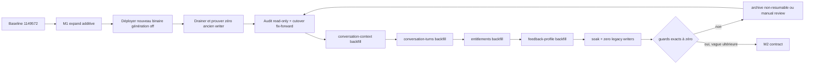

# ARIA V1 — Canonical Application Core

## Statut et autorité

- Version du document : `2.1.0`
- Date : `2026-08-31`
- Baseline de conception : `1149572f5bf85b43bc10c870cb4fd81b336f7f56`
- Décision opérateur : `ARCHITECTURE_DESIGN_V2=APPROVED`
- Option retenue : `OPTION_2_CANONICAL_APPLICATION_CORE`
- Portée de PR #200 : `ARIA Conversation Foundation`
- Statut du code à la baseline : `PARTIAL_IMPLEMENTATION_PENDING_ZERO_DEBT_PROOF`
- Statut courant de PR #200 : `IMPLEMENTED_PENDING_FINAL_QUALIFICATION`

Ce document et [ARIA_PERSONAL_LEARNING_OS_DATA_MODEL.md](./ARIA_PERSONAL_LEARNING_OS_DATA_MODEL.md) sont les sources de vérité d'architecture versionnées. Les canvases externes et prototypes sont des aides de conception, jamais des preuves d'implémentation.

Les assertions de ce document portent toujours un marqueur de livraison :

- `IMPLEMENTED` : prouvé sur le HEAD courant par code et test ;
- `IN_#200` : contrat approuvé à réaliser et prouver dans PR #200 ;
- `FUTURE_LOT` : extension réservée, non livrée et non revendiquée.

| Domaine | Statut courant | Preuve attendue |
| :--- | :--- | :--- |
| Baseline `1149572` | `IMPLEMENTED_PARTIAL` | inventaire du dépôt ; aucune métrique zéro-dette revendiquée |
| Conversation Foundation décrite ici | `IMPLEMENTED_PENDING_FINAL_QUALIFICATION` | matrice requirement→test, CI exact-head, migrations, RAG companion et reviews fraîches |
| Cockpit, périodes académiques, Evidence/mastery/NBA, génération/pratique/correction/agents | `FUTURE_LOT` | lots C à G ; aucun modèle prématuré dans #200 |

```text
PR_200_STATUS=IMPLEMENTED_PENDING_FINAL_QUALIFICATION
ARIA_C_STATUS=FUTURE_LOT_NOT_IMPLEMENTED
ARIA_D_STATUS=FUTURE_LOT_NOT_IMPLEMENTED
ARIA_E_STATUS=FUTURE_LOT_NOT_IMPLEMENTED
ARIA_F_STATUS=FUTURE_LOT_NOT_IMPLEMENTED
ARIA_G_STATUS=FUTURE_LOT_NOT_IMPLEMENTED
```

## 1. Décision structurante

ARIA expose une façade applicative canonique **par cas d'usage**. Il n'existe pas de god-function commune à tous les workflows.



Les cas d'usage partagent l'identité actor/subject, les règles d'accès, les politiques de sécurité, les capacités de modèles, la visibilité, l'idempotence et les primitives de jobs. Ils ne partagent pas leur orchestration métier, leur agrégat ou leur cycle de persistance.

PR #200 possède un seul cas d'usage génératif : `runConversation`. Les queries et commandes non génératives — curriculum disponible, historique, préférences et feedback — passent par des façades dédiées du même bounded context et n'appellent ni RAG, ni prompt, ni modèle.

## 2. Boucle pédagogique



La conversation de #200 implémente une action pédagogique et conserve sa provenance. Elle ne crée pas directement une maîtrise. Les futures Evidence sont des faits observables immuables ; la maîtrise est une projection reconstruisible et les Next Best Actions sont un ranking explicable et versionné.

## 3. Frontières de modules

```text
app/api/aria/**                 components/aria/**
        │                              │
        └──────────────┬───────────────┘
                       ▼
lib/aria/application/<use-case>/public.ts
                       │
          ┌────────────┼────────────┐
          ▼            ▼            ▼
       kernel       domain ports   policies/manifests
                       │
                       ▼
                 infrastructure
          ┌────────────┼────────────┐
          ▼            ▼            ▼
       Prisma       RAG API      model providers
```

Règles mécaniques :

- une route ou un composant n'importe que les barrels publics applicatifs ;
- une route ne peut importer Prisma, un prompt, le RAG, un provider ou le gateway interne ;
- seul l'adapter gateway importe un SDK fournisseur ;
- les agents futurs n'importent jamais Prisma et passent par des command services ;
- les transports SSE et JSON traduisent le même résultat/flux typé ; ils ne reconstruisent aucune règle métier ;
- des tests AST/import graph, `no-restricted-imports` et `aria:integrity` font échouer la CI en cas de violation.

Les types opaques renforcent ces limites mais ne les remplacent pas.

## 4. Identité, sujet et contexte autorisé

```text
AriaActor
  actorUserId
  actorRole
  principalKind = INTERACTIVE | SYSTEM_JOB

AriaSubject
  studentId
  academicContext
```

Une route élève résout toujours `subject=self`. Elle refuse `studentId`, grade, track, entitlement ou tout override académique venant du client. Les futurs accès coach et jobs système utilisent des résolveurs de cible séparés, fondés sur une affectation ou une identité de service préalablement autorisée.

Le seul builder de contexte conversationnel est `buildAriaConversationContext`. Il résout, en une fois :

1. actor et subject ;
2. élève et Academic Map courant ;
3. `courseKey` demandé et capability prouvée ;
4. grant ARIA générique et scopes de cours ;
5. préférences, sans les utiliser comme autorisation ;
6. conversation et intégrité cours/élève ;
7. skill et ressource/version demandés ainsi que tout contexte skill/ressource déjà persisté sur la conversation ;
8. politiques sécurité, pédagogie, retrieval et modèle.

Le core reçoit un contexte opaque, déjà autorisé, avec un `courseKey` obligatoire. Aucun `Subject`, grade par défaut, cours par défaut, Terminale par défaut ou Maths par défaut n'entre dans le core.

Le modèle commercial converge vers `aria_access + explicit course scopes`. `Entitlement` reste la vérité du statut, des dates, de la source commerciale, de la révocation et de l'extension. Un `sourceSubscriptionId` nullable unique garantit qu'une Subscription source ne produit qu'un seul Entitlement ARIA lors des reprises concurrentes du backfill. Un enfant relationnel strict `AriaEntitlementScope` porte seulement `GLOBAL` ou un `courseKey` explicite, avec contraintes CHECK/unique et lineage vers l'Entitlement ; les scopes ne sont pas enfouis dans `metadata`. Les anciens codes produits peuvent accorder ce grant, mais il n'existe pas une FeatureKey par matière et il ne subsiste qu'un builder d'entitlement runtime.



## 5. Contrat de `runConversation`

La commande canonique est stricte et conceptuellement équivalente à :

```text
RunConversationCommand
  clientRequestId       required, opaque UUID
  courseKey             required, AriaCourseKey
  message               required
  conversationId        optional
  pedagogicalMode       required/defaulted by declared policy, never by grade
  skillId               optional
  resourceId            optional; stable canonical identity
```

`studentId`, `subject`, `gradeLevel`, `academicTrack`, entitlement et champs inconnus sont refusés. Le transport peut refléter `clientRequestId` dans `Idempotency-Key`; si les deux sont fournis ils doivent être identiques.
`resourceVersionId` n'est jamais fourni par le client : le contexte autorisé le résout depuis le Resource Registry, l'inclut dans l'empreinte idempotente et le persiste dans la policy du Turn avant tout appel modèle.

### 5.1 Matrice API/route cible de #200

| Route | Méthode | Command/query publique | Entrée canonique | Sortie | Accès |
| :--- | :---: | :--- | :--- | :--- | :--- |
| `/api/aria/chat` | POST | `runConversation` | schéma strict : clientRequestId, courseKey, message, mode et context IDs optionnels | SSE par défaut ou résultat JSON du même Turn | élève, `subject=self`, cours autorisé |
| `/api/aria/turns/{turnId}/cancel` | POST | `cancelConversationTurn` | schéma strict `{clientRequestId}` correspondant au Turn | état accepté/terminal idempotent | owner du Turn seulement |
| `/api/aria/conversations` | GET | `listConversations` | courseKey + curseur opaque | conversations `(updatedAt DESC,id DESC)` | élève, cours autorisé |
| `/api/aria/conversations/{id}/messages` | GET | `getConversationMessages` | curseur opaque | page récente, réordonnée chronologiquement | owner + course integrity |
| `/api/aria/curriculum` | GET | `listAvailableCourses` | aucune identité académique client | Academic Map + capabilities + access state | élève authentifié |
| `/api/aria/profile` | GET/PUT | `get/updateLearningPreferences` | PUT strict `version:1` | préférences, jamais Academic Map | élève authentifié |
| `/api/aria/feedback` | POST | `submitConversationFeedback` | messageId, useful, reason bornée | upsert canonique | owner du message seulement |
| `/api/aria/resources` | GET | `listVisibleResources` | courseKey | ResourceVersion DTOs visibles | élève + course/resource policy |
| `/api/aria/resources/{resourceId}/versions/{resourceVersionId}/content` | GET | `readVisibleResourceVersion` | identité ressource + version immutable | contenu/redirect sûr | owner/visibility/course |

Les routes historiques basées sur `subject` ne font pas partie du contrat cible. Les erreurs pré-stream restent JSON ; après `start`, seul le terminal SSE typé est possible.

Les modes sont des valeurs métier de premier rang :

```text
DISCOVERY
GUIDED_PRACTICE
INDEPENDENT_PRACTICE
CHECK_MY_WORK
CORRECTION
WORKED_EXAMPLE
EXAM_SIMULATION
REVISION
METHODOLOGY
```

#200 n'active que les modes dont les policies sont effectivement implémentées et testées. Une valeur connue mais non activée pour la combinaison cours/agent est refusée. La Global Safety Policy ne contient jamais la règle universelle « ne pas donner la réponse » : le dévoilement dépend de la Task Pedagogical Policy.

## 6. Lifecycle, idempotence et concurrence

### 6.1 Source de vérité

`AriaConversationTurn.status` est l'unique source de vérité du lifecycle d'exécution :



Les états terminaux sont immuables. `STREAMING` est un comportement de transport, pas un état métier persisté.

`AriaMessage.status` ne pilote plus aucune exécution. Pendant le rollout expand/contract, sa colonne legacy est :

- inaccessible aux command services ;
- fixée à `COMPLETED` pour le message utilisateur accepté, indépendamment du devenir de la génération ;
- strictement projetée depuis le Turn **uniquement pour le message assistant lié** (`PENDING/RUNNING → STREAMING`, puis terminal exact) ;
- encore mutable uniquement par l'ancien binaire sur ses messages `turnId IS NULL` pendant la courte phase pré-cutover ; le nouveau binaire la traite en lecture seule ;
- supprimée par la migration contract après vérification du backfill et retrait des anciens binaires.

La CI interdit toute écriture dans les nouveaux modules ; le trigger interdit toute écriture indépendante dès qu'un message est lié. Le drainage des anciens writers précède le backfill de liaison. Ainsi :

```text
CONVERSATION_EXECUTION_STATUS_SOURCES_OF_TRUTH=1
```

### 6.2 Clé et empreinte

Chaque Turn stocke `clientRequestId`, `requestFingerprint`, actor, subject et use case. La contrainte unique porte sur `(actorUserId, subjectStudentId, useCase, clientRequestId)`.

- même clé + même empreinte : retourne le même Turn ;
- même clé + empreinte différente : `409 IDEMPOTENCY_CONFLICT` ;
- Turn terminal : résultat reconstruit depuis la persistance, sans provider ;
- Turn actif : `202 TURN_IN_PROGRESS` avec le même turnId/status/retryAfter, sans second provider ;
- clé différente sur la même conversation active : `409 CONVERSATION_BUSY`.

Une contrainte PostgreSQL partielle garantit au plus un Turn `PENDING` ou `RUNNING` par conversation. Les collisions Prisma sont relues et classées, jamais transformées en seconde génération.

L'admission distribuée des générations est une policy du cas d'usage, pas du transport. L'application effectue d'abord un lookup idempotent strictement en lecture, scindé par actor + subject + use case + `clientRequestId` et vérifié par empreinte. Un Turn déjà présent est rejoué ou signalé actif sans consommer de quota. Pour une clé nouvelle, l'admission actor est évaluée **avant TX1** : un refus ou une indisponibilité du backend ne crée donc ni conversation, ni Turn, ni message, ni watchdog. Seul `ALLOWED` autorise la réservation durable. Une course entre deux requêtes identiques reste fermée par le verrou d'idempotence et produit au plus un Turn et un appel provider.

### 6.3 Transactions

```mermaid
sequenceDiagram
    participant A as Application
    participant DB as PostgreSQL
    participant L as Distributed admission
    participant R as RAG
    participant M as Model gateway

    A->>DB: read-only idempotency lookup
    alt existing Turn
        DB-->>A: active or terminal canonical Turn
    else new key
        A->>L: admit actor before durable writes
        L-->>A: allowed / denied / unavailable
    end
    alt new key and allowed
        A->>DB: TX1 reserve PENDING Turn + messages + watchdog
        DB-->>A: committed PENDING Turn
        A->>DB: short CAS PENDING → RUNNING + token + lease
        DB-->>A: claimed RUNNING Turn
        A->>R: retrieval hors transaction
        R-->>A: typed retrieval result
        A->>M: generation hors transaction
        M-->>A: typed token/result stream
        A->>DB: bounded heartbeat (10 s max interval)
        A->>DB: TX2 CAS RUNNING → terminal + content + citations + metadata
    else denied or unavailable
        A-->>A: stable pre-stream error; zero durable conversation writes
    end
```

Aucune transaction n'englobe un appel réseau, le LLM ou un stream SSE. TX2 ne finalise que `RUNNING + executionToken` et écrit atomiquement contenu, citations, metadata, état terminal, watchdog et projection legacy. Aucun événement terminal n'est émis avant son commit.

### 6.4 Recovery autonome

TX1 crée un watchdog dans le `JobOutbox` canonique. Un worker planifié traite le watchdog indépendamment d'une nouvelle requête. En production, l'activation des writes Turn exige ce worker ; le startup échoue fermé si le worker est désactivé :

- heartbeat au plus toutes les 10 secondes pendant l'exécution ;
- seuil stale de 60 secondes, valeurs configurables et bornées ;
- heartbeat récent : lease Turn et watchdog replanifiés atomiquement ;
- heartbeat expiré sans demande d'annulation : CAS `PENDING|RUNNING → ERROR` avec token/fencing, raison interne observable `EXECUTION_INTERRUPTED` et mapping public redacted ; un `PENDING` avec annulation demandée devient d'abord `CANCELLED`, jamais `ERROR` ;
- terminal : watchdog complété idempotemment.

Le watchdog est créé dans TX1 avec une clé unique par Turn, `availableAt=leaseExpiresAt` et un payload `{turnId}` sans PII. Un worker claim d'abord un Job dans une transaction job-only et la commit ; sa transaction de recovery verrouille ensuite Turn→Job et revérifie owner/token. Aucun verrou Job n'est conservé pendant l'acquisition du Turn. Heartbeat, finalisation et recovery respectent ainsi un seul ordre Turn→Job. Le watchdog reste retryable tant que son Turn est actif, même après le seuil d'alerte.

V1 ne checkpoint pas chaque token et ne promet pas la reprise d'un flux après crash. Le buffer est persisté une fois lors d'une finalisation normale ou d'une annulation observée ; un crash peut perdre le buffer en mémoire mais ne laisse jamais le Turn éternellement `RUNNING`. Les futures tâches longues réutilisent les primitives lease/outbox sans détourner l'agrégat conversationnel.

L'annulation est une commande stricte et autorisée. Sur `PENDING`, une transaction CAS pose actor/timestamp et effectue immédiatement `PENDING→CANCELLED`, projette le placeholder Message et complète le watchdog. Si le claim concurrent gagne, le cancel relit `RUNNING`, pose idempotemment `cancellationRequestedAt`, signale le contrôleur local et la demande est relue au heartbeat inter-process. Un état terminal se rejoue ; une déconnexion SSE seule ne cancel pas : elle détache le transport et permet au même `clientRequestId` de retrouver/rejouer le Turn.

## 7. Historique et prompt

L'historique complet reste en base et l'API d'historique est paginée par `(createdAt DESC,id DESC)` avec curseur opaque portant les deux valeurs, puis ordre chronologique dans la page. Le prompt reçoit les Turns pertinents les plus récents selon un budget déterministe versionné, pas une constante permanente « 10 messages » :

- charger les Turns terminés les plus récents, par pages bornées ;
- conserver les paires user/assistant complètes ;
- calculer un coût déterministe par rôle, caractères et métadonnées ;
- sélectionner du plus récent au plus ancien jusqu'au budget ;
- renverser la sélection avant le prompt ;
- exclure les placeholders et sorties terminales non complétées sauf policy explicite.

La sommation d'historique ancien sera une projection dérivée future. Elle ne remplace ni ne tronque l'historique canonique.

## 8. Retrieval et pédagogie

La résolution prend simultanément : task/mode, `courseKey`, version de ressource demandée, rôle d'agent, visibilité et capabilities prouvées.

Modes de plan :

```text
NO_MODEL
GENERAL_CHAT
OPTIONAL_GROUNDING
GROUNDED_REQUIRED
RESOURCE_GROUNDED_REQUIRED
```

États d'exécution RAG :

```text
NOT_CONFIGURED
NO_RESULTS
RUNTIME_UNAVAILABLE
SUCCESS
```

Chaque paire plan × état possède une décision explicite. En particulier, `RUNTIME_UNAVAILABLE` ne devient jamais une génération non groundée sauf si `OPTIONAL_GROUNDING` l'autorise explicitement. `NO_RESULTS` reste distinct et est enregistré dans les métadonnées. `NO_MODEL` interdit tout appel au gateway.

| Retrieval plan | `SUCCESS` | `NO_RESULTS` | `NOT_CONFIGURED` | `RUNTIME_UNAVAILABLE`/timeout |
| :--- | :--- | :--- | :--- | :--- |
| `NO_MODEL` | aucun retrieval/modèle | aucun modèle | aucun modèle | aucun modèle |
| `GENERAL_CHAT` | grounding non demandé | modèle autorisé, statut observé | modèle autorisé, statut observé | modèle autorisé seulement car la policy l'annonce |
| `OPTIONAL_GROUNDING` | contexte + citations | modèle autorisé avec `NO_RESULTS` | modèle autorisé avec `NOT_CONFIGURED` | modèle autorisé avec downgrade explicitement tracé |
| `GROUNDED_REQUIRED` | contexte + citations obligatoires | échec `RAG_UNAVAILABLE` | échec `RAG_UNAVAILABLE` | échec `RAG_UNAVAILABLE` |
| `RESOURCE_GROUNDED_REQUIRED` | version demandée et citation exacte obligatoires | échec `RAG_UNAVAILABLE` | échec `RAG_UNAVAILABLE` | échec `RAG_UNAVAILABLE` |

La policy est résolue depuis mode/tâche, cours, ResourceVersion demandée, rôle agent, visibilité et capabilities. Une collection physique, seule, ne prouve ni une capability ni un document.

Le contrat RAG `/search/v2` v1 reste lié au corpus et au manifeste, sans accepter de filtre documentaire libre du client. L'adapter Nexus conserve donc sans réinterprétation toutes les identités immuables retournées ; le cas d'usage conversationnel impose ensuite l'égalité exacte `resourceId + resourceVersionId` avant le prompt et le modèle. L'absence de cette version dans les résultats échoue fermée avec `RAG_UNAVAILABLE`, sans élargissement à une autre ressource. Tout futur filtre serveur par ResourceVersion devra d'abord être ajouté au contrat RAG versionné puis importé byte-identical, jamais inventé localement par Nexus.

Les policies sont composées :

```text
Global Safety Policy
  × Agent Role
  × Pedagogical Mode Policy
  × Subject Policy
  × Retrieval Plan
```

Un rôle d'agent n'est pas dupliqué par matière.

## 9. Resource Registry et contrat RAG cross-repo

Nexus possède le Resource Registry : identités stables, versions immuables, hash, provenance, owner et visibilité. Une citation canonique contient au minimum `resourceId`, `resourceVersionId`, `contentSha256`, `chunkId`, un `locator` strict (page/section/offset selon type), `corpusId`, `corpusVersionId` et `manifestSha256`. Avant TX2, chaque citation doit correspondre exactement à un hit effectivement retourné au Turn courant sur ces huit champs ; être seulement présent dans le manifeste ne suffit pas.

La transition initiale est contrôlée : les identités déjà gouvernées dans les tables d'ingestion RAG sont importées une fois, comparées exhaustivement à leurs hashes/attributions, puis scellées dans le Resource Registry Nexus. Ce bootstrap ne crée pas deux autorités durables. Après publication du digest initial, toute création ou nouvelle version de ressource part du Resource Registry Nexus et le RAG ne peut que l'indexer/référencer.

#200 gèle explicitement les paths RAG qui mintent actuellement `resource_id/artifact_id` : toute nouvelle identité absente de l'export Nexus échoue `RESOURCE_REGISTRY_ISSUANCE_REQUIRED`. ARIA-F livrera le command service d'issuance Nexus avant réactivation.

Le dépôt RAG sibling possède le **servable corpus manifest** : binding physique, version de corpus, versions de ressources indexées, état de promotion et digest. Le contrat porte aussi `resourceRegistryVersion/resourceRegistrySha256`. Il ne possède aucune identité documentaire concurrente et ne publie pas de mapping `courseKey → collection`. Son index versionné expose le digest actif, les manifests N/N-1 supportés et leur `retireAt`; le document d'un digest est immuable. Un digest N-2, inconnu, retiré ou lié à un autre Registry échoue fermé.

Le fichier monté au runtime Nexus porte le nom `<manifestSha256>.aria-rag-manifest` et contient les octets JSON du manifeste canonique. Ce suffixe de transport dédié évite que le traceur standalone interprète un chemin de déploiement `*.json` comme un glob sur tous les JSON du dépôt. Le loader exige une racine absolue, refuse les symlinks, ouvre avec `O_NOFOLLOW`, lit et vérifie le digest depuis le même descripteur. Pendant la transition, le déploiement RAG publie **à la fois** l'ancien `<manifestSha256>.json` pour les Nexus déjà déployés et ce nouveau nom ; Nexus #200 ne consomme que le nouveau nom. Le gate de production inspecte les `.nft.json` des neuf routes ARIA et refuse toute capture de tests, E2E, couverture ou artifacts locaux.

Nexus possède le mapping capability `courseKey + pedagogicalMode + agentRole → corpusId`. Le RAG possède le binding `corpusId → physical collection`. Nexus consomme un lock généré et vérifié du manifeste publié ; ce lock n'est jamais édité manuellement.



Ordre de bootstrap et déploiement :

1. le contrat RAG versionné définit aussi `resourceRegistryVersion/resourceRegistrySha256` ;
2. Nexus importe une fois les identités RAG auditées, les scelle dans son Resource Registry et exporte le registre canonique ;
3. le RAG rejette toute identité/hash absente de cet export, produit le manifeste final lié au digest Registry et conserve N-1 jusqu'à sa date de retrait publiée ;
4. Nexus importe ce manifeste final en lock byte-identical avec source commit/version/SHA ;
5. les CI des deux dépôts valident le contrat, le Registry digest et le manifest digest ;
6. le RAG déploie et expose son digest actif ;
7. le preflight Nexus exige le digest piné ; une incompatibilité échoue fermée avant le trafic ;
8. Nexus déploie ; un rollback Nexus repointe le lock N-1 encore servi.

Les schemas HTTP (`retrieval-request`, `retrieval-response`, `retrieval-error`, envelope d'identité, index et manifeste) sont exportés par le package RAG avec SemVer, `$id`, digest et commit producteur, puis importés byte-identical par Nexus. Une fixture de signature commune vérifie l'interopérabilité Python/Node. L'identité interne autorise le replay read-only uniquement si le hash exact de la requête est identique et non expiré ; tout conflit de scope ou manifeste est refusé.

Le contenu d'une ResourceVersion est lu derrière le port applicatif. La décision de faisabilité #200 n'ajoute ni addon natif ni FFI : Node 22 n'expose pas directement la primitive noyau recherchée et un nouveau sous-système natif serait une dette disproportionnée. Sous Linux, le repository ouvre la racine canonique allowlistée avec `O_DIRECTORY | O_NOFOLLOW`, descend chaque segment relativement à `/proc/<pid>/fd/<directory-fd>` avec `O_NOFOLLOW`, et vérifie à chaque étape `lstat`, `realpath`, device et inode. Le fichier final est ouvert avec `O_NOFOLLOW`; taille et identité sont contrôlées avant et après la lecture sur le même descripteur. Un maximum strict de 16 MiB borne la lecture ; SHA-256 et MIME sont calculés depuis ces octets, tous les descripteurs sont fermés, puis le client reçoit ce **snapshot immuable** vérifié. Une substitution après vérification ne peut donc modifier les octets diffusés. Hors Linux, sur symlink, changement d'inode/taille, digest/MIME invalide ou échec de fermeture, l'ouverture échoue fermée. La réponse applique un `Content-Disposition` sûr et aucun chemin local n'entre dans une erreur publique.

Le dépôt RAG est actuellement modifié par d'autres travaux. L'implémentation utilisera un worktree/PR séparé et ne modifiera jamais ces changements non liés.

## 10. Model policy et erreurs

Le frontend ne connaît aucun provider ou modèle. Le gateway reçoit des exigences : vision, reasoning, structured output, tool calling, contexte, classe de latence et de coût. Un fallback n'est autorisé que si les capacités sont équivalentes et la policy le déclare ; il reste observable dans les métadonnées.

La configuration distingue explicitement hosted OpenAI et endpoint compatible local. Une clé fictive ne peut jamais être envoyée à un endpoint public. L'absence de configuration échoue avec une erreur interne typée et publique redacted.

Le gateway combine le signal caller et un timeout interne borné. Il distingue en interne `USER_CANCELLED`, `MODEL_TIMEOUT` et `PROVIDER_UNAVAILABLE`, sans exposer leurs détails. Avant l'application ARIA, l'envelope d'authentification plateforme expose uniquement `AUTHENTICATION_REQUIRED` (401) et `ROLE_NOT_ALLOWED` (403) ; aucune route ARIA ne réinterprète ces décisions. Le contrat applicatif comprend ensuite la taxonomie métier, deux conflits de contrôle et un résultat actif non-error :

| Code public | HTTP JSON | Phase autorisée | Représentation SSE | Retry transport |
| :--- | :---: | :--- | :--- | :---: |
| `AUTHENTICATION_REQUIRED` | 401 | envelope plateforme pré-stream | aucune ; réponse JSON avant ouverture | après authentification |
| `ROLE_NOT_ALLOWED` | 403 | envelope plateforme pré-stream | aucune ; réponse JSON avant ouverture | non |
| `BAD_REQUEST` | 400 | pré-stream uniquement | aucune ; réponse JSON avant ouverture | non |
| `COURSE_NOT_FOUND` | 404 | pré-stream uniquement | aucune ; réponse JSON avant ouverture | non |
| `NOT_ENROLLED` | 403 | pré-stream uniquement | aucune ; réponse JSON avant ouverture | non |
| `NOT_ENTITLED` | 403 | pré-stream uniquement | aucune ; réponse JSON avant ouverture | non |
| `UNSUPPORTED` | 422 | pré-stream uniquement | aucune ; réponse JSON avant ouverture | non |
| `CONVERSATION_NOT_FOUND` | 404 | pré-stream uniquement | aucune ; réponse JSON avant ouverture | non |
| `IDEMPOTENCY_CONFLICT` | 409 | réservation pré-stream | aucune ; réponse JSON avant ouverture | non |
| `CONVERSATION_BUSY` | 409 | réservation pré-stream | aucune ; réponse JSON avant ouverture | oui, après `retryAfter` avec une nouvelle clé |
| `RATE_LIMIT_EXCEEDED` | 429 | admission pré-stream | aucune ; réponse JSON avant ouverture | oui |
| `RATE_LIMIT_BACKEND_UNAVAILABLE` | 503 | admission pré-stream | aucune ; réponse JSON avant ouverture | oui |
| `RAG_UNAVAILABLE` | 503 | runtime JSON ou post-start | événement terminal `error` si le stream est ouvert | selon policy/métadonnée |
| `MODEL_UNAVAILABLE` | 503 | runtime JSON ou post-start | événement terminal `error` si le stream est ouvert | selon policy/métadonnée |
| `INTERNAL_ERROR` | 500 | toute phase | JSON avant ouverture, événement terminal `error` après `start` | non automatique |
| `TURN_IN_PROGRESS` | 202 | résultat de réservation, non-error | aucun stream ouvert ; body `{turnId,status,retryAfter}` | oui, même commande et même clé |

Toute erreur JSON utilise `{error:{code,requestId,retryable}}`. Après l'événement `start`, HTTP est déjà 200 et seul `{type:"error",code,requestId,retryable}` peut terminer le stream. Les détails sont journalisés après redaction avec `requestId`.

## 11. Feedback, profil et conversation legacy

`AriaFeedback` est l'unique vérité du feedback, écrit par upsert idempotent. Aucun trigger ni command service ne réécrit `AriaMessage.feedback` ; le champ DTO legacy est dérivé à la lecture depuis `AriaFeedback` pendant le rollout, puis la colonne est supprimée. Aucune erreur de persistance n'est avalée.

L'Academic Map détermine les cours réels. Le profil stocke uniquement une préférence versionnée consommée :

```text
pinnedCourseKeys
focusedCourseKey
courseOrder
showCitations
```

Le moteur frontend ne transforme jamais l'ordre de l'Academic Map en cours implicite. À l'ouverture, seul un contexte demandé, la sélection utilisateur courante encore autorisée ou `focusedCourseKey` peut sélectionner un cours. En leur absence, le sélecteur reste sur « Choisir un cours » et le composer demeure désactivé jusqu'au choix explicite.

L'API utilise un PUT de remplacement complet `version: 1`, permet de vider pins/focus/order, rejette les doublons et exige des clés de l'Academic Map. `courseOrder` peut être partiel ; les cours restants gardent l'ordre Academic Map. Un changement de cursus filtre l'effective view sans supprimer silencieusement l'ancienne valeur stockée.

`selectedCourseKeys` n'est ni une autorisation, ni une condition `SETUP_REQUIRED`. Son contenu legacy est audité : l'initialisation automatique « tous les cours » devient un ordre par défaut, tandis qu'une intention utilisateur prouvée peut être migrée en pins ; aucune conversion ambiguë n'est silencieuse.

Les conversations legacy `courseKey=null` sont auditées et backfillées uniquement si le mapping est unique à partir des données académiques explicites. Les lignes ambiguës restent lisibles mais sont marquées `LEGACY_CONTEXT_UNRESOLVED` et non reprenables. Le core ne reçoit jamais de course nullable.

## 12. Frontend et transports

Il existe un seul moteur produit authentifié : `AriaChatPanel` et son client/hook canonique.

- le dashboard utilise un launcher/wrapper du panel ;
- les workspaces futurs réutilisent le panel ;
- tous les cours viennent de l'Academic Map enrichie de la capability et de l'accès ; seuls `hasChat && entitled` sont sélectionnables ; focus disponible puis premier disponible, sinon état vide explicite ;
- l'historique, le feedback et le stream utilisent les contrats canoniques ;
- la page publique `/plateforme-aria` est une démonstration marketing statique et ne lance aucune conversation réelle.

Le protocole SSE possède un seul parser à schéma runtime discriminé. UTF-8 fragmenté, events fragmentés ou multiples, flush final, JSON invalide, forme invalide, event inconnu et abort sont tous définis et testés. JSON collecte le même flux/résultat canonique ; il ne relance jamais un pipeline.

### 12.1 Privacy et visibilité

| Donnée | Défaut | Extension autorisée | Interdit |
| :--- | :--- | :--- | :--- |
| Conversation/message brut | `STUDENT_PRIVATE` | partage explicite futur, audité et révocable | visibilité parent/coach automatique |
| Feedback conversationnel | `STUDENT_PRIVATE` + système qualité restreint | agrégat anonymisé | contenu brut dans logs ordinaires |
| ResourceVersion officielle/curated | policy Registry | audiences déclarées | déduire la visibilité du corpus RAG |
| ResourceVersion personnelle | owner étudiant | partage explicite futur | accès cross-student |
| Signal/Evidence futur | policy propre par fait | `COACH_VISIBLE`/`PARENT_VISIBLE` explicites | hériter automatiquement de la visibilité du chat |
| Métadonnée opératoire | `SYSTEM_ONLY` | personnel habilité | prompt, message, email ou account id en clair |

Le rendu Markdown n'autorise pas le HTML brut, filtre les schémas URL et encode tout contenu non fiable. Les documents RAG sont des données non fiables délimitées : leurs instructions ne peuvent remplacer les policies système/tâche.

## 13. Academic context et domaines futurs

Chaque Turn capture un `academicContextSnapshot` strict versionné : cours, grade/track/pathway connus, curriculum version et dimensions manquantes. Le format réserve des références optionnelles `academicPeriodId`, `academicYear` et `curriculumVersion` sans créer dans #200 un second modèle scolaire. ARIA-D crée `AcademicPeriod` et migre/rattache ces snapshots.

Les métriques restent séparées :

- `ACADEMIC_MAP_REPRESENTATION_COVERAGE` ;
- `ARIA_CAPABILITY_COVERAGE`.

Candidat libre demeure `NOT_PROVEN`. Le modèle LVA/LVB et des dimensions variables demeure non approuvé avant inventaire complet ; aucune donnée libre JSON ne remplace cette décision.

Les futurs contrats respectent :

- Evidence immuable et sourcée ; mastery reconstruisible avec algorithmVersion, confidence, evidenceCount et lastEvidenceAt ;
- NBA déterministe avec reasonCode, evidenceRefs, cours/skill et priorité ; les reason codes initiaux prévus sont `WEAK_SKILL`, `RECENT_ERROR`, `UPCOMING_ASSESSMENT`, `ACTIVE_GOAL`, `OVERDUE_WORK`, `SPACED_REVIEW` et `INCOMPLETE_CORRECTION` ;
- outils agent classés `READ_ONLY`, `CREATE_DRAFT`, `USER_REQUESTED_WRITE`, `PRIVILEGED` ;
- aucune mutation d'inscription, abonnement, paiement ou grade hors workflow métier autorisé ;
- boucles agents bornées par steps, timeout, tokens/coût, outils et capabilities ;
- corrections distinguant `AI_DRAFT`, `HUMAN_VALIDATED`, `FORMATIVE_ESTIMATE`, `OFFICIAL_RUBRIC` ;
- taxonomy d'erreurs extensible et typée — `KNOWLEDGE_GAP`, `METHOD_ERROR`, `CALCULATION_ERROR`, `MISREAD_INSTRUCTION`, `JUSTIFICATION_MISSING`, `NOTATION_ERROR`, `CONCEPT_CONFUSION` — portée par les futures observations/corrections, jamais encodée prématurément dans #200 ;
- conversations `STUDENT_PRIVATE` par défaut, signals dérivés partageables séparément.

## 14. Lots

### PR #200 — Conversation Foundation

Application boundary, authorization/entitlements, Turn lifecycle/idempotency/concurrency/recovery, historique, feedback, SSE/JSON, policy RAG et manifests nécessaires, identité/version ressource nécessaire aux citations, gateway, profil préférentiel strict, moteur chat unique, enforcement d'architecture, docs et tests.

### ARIA-C — Cockpit et workspaces

Priorité UX : aujourd'hui, plan/priorités, progrès/difficultés, cours, corrections, ressources, conversations. Aucun faux pourcentage, badge ou état RAG ne devient la hiérarchie principale.

### ARIA-D — Academic Temporal Model

Périodes/années scolaires, historique de contexte, inventaire et modèle des dimensions académiques variables, candidat libre et rattachement des faits.

### ARIA-E — Evidence, mastery et décision

Evidence immuable, projections, journey, goals après audit, NBA reason-coded et boucle Observe→Adapt.

### ARIA-F — Ressources, pratique et plan

Génération asynchrone, pratique/tentatives, Resource Registry complet, plan après audit de `RoadmapTask`.

### ARIA-G — Submissions, corrections et agents

Audit `CopySubmission`/`PedagogicalReport`, dépôt élève, correction async, validation/publication, rôles/outils agents bornés.

Le flow d'acceptation final est : faible Evidence → recommandation → action acceptée → pratique/ressource → tentative → correction → nouvelle Evidence → projection reconstruite → recommandation modifiée.

## 15. Migration, backfill et opérations de production



M1 ne supprime aucune donnée. `AriaDataMigrationRun` et `AriaDataMigrationRowAudit` scellent digest source, classification, target refs et before-images allowlistées sans contenu/PII ; rollback/reprise utilisent CAS et source fingerprints. Chaque backfill exécute `audit → apply avec digest des comptes attendus → verify`, est reprenable et classe chaque ligne en `DETERMINISTIC_BACKFILL`, `ARCHIVED_NON_RESUMABLE` ou `MANUAL_REVIEW_REQUIRED`. Une conversation `courseKey=null` ambiguë n'est jamais transformée en Maths/Terminale : elle reste lisible, non reprenable et sans suppression silencieuse. M2 n'est ni déployé ni regroupé avec M1 ; ses guards exigent une classification persistée toujours cohérente et bloquent tant qu'une donnée runtime demeure ambiguë ou qu'un ancien writer existe.

Le backfill B2 utilise le planner versionné `conversation-turns/v2`. Son snapshot lie l'acteur, l'élève, la conversation, `courseKey`, `contextState`, `contextVersion`, l'ordre `(createdAt,id)` et le maximum de séquence initial. Seule une paire terminale contiguë `user COMPLETED → assistant COMPLETED|CANCELLED|ERROR` devient un Turn `LEGACY_IMPORT` portant exactement cet état terminal. Les messages système, non terminaux, orphelins ou à contexte non résolu sont archivés individuellement ; les timestamps égaux, séquences terminales non alternées et rôle/statut inconnu deviennent des audits MANUAL individuels reliés par un `clusterId`, jamais une paire inventée. La partition est mécanique : `scanned = 2 × deterministic + archived + manualReview`, chaque message apparaît exactement une fois. La fixture PostgreSQL qualifiée fixe `24 messages = 2 × 8 Turns + 4 ARCHIVED + 4 MANUAL`, avec quatre Turns `COMPLETED`, deux `CANCELLED` et deux `ERROR`. APPLY verrouille les sources, revalide le snapshot, refuse toute collision au lieu de l'ignorer, puis la transition du Run vers `COMPLETED` est gardée par les preuves ligne-à-ligne. Le guard compare les IDs audités à l'univers source éligible complet, refuse omission, substitution post-DRY et réutilisation d'une source déjà auditée, puis reconstruit le planner v2 depuis les messages live. Il exige l'égalité exacte des classifications, raisons, clusters, paires contiguës et séquences ; il recalcule aussi byte-for-byte les identités et fingerprints SHA-256, singleton compris, avec les primitives PostgreSQL natives, sans extension crypto ou dépendance native. Enfin, l'ensemble des Turns portant le `migrationRunId` doit être exactement celui des cibles déterministes auditées : aucune cible sans audit ne peut terminaliser ni survivre au rollback. Replay et verify reconstruisent indépendamment le même univers et le même plan côté application ; pour une preuve historique, la borne initiale est le maximum vivant strictement inférieur à la première séquence auditée, ce qui exclut les Turns ultérieurs tout en refusant un saut de séquence forgé. Un run vide revalide encore l'univers source. Rollback prend les mêmes verrous de table que APPLY, revalide les fingerprints, puis impose LIFO par conversation : un run B2 antérieur ne peut être supprimé tant qu'un run B2 `COMPLETED` possède une séquence ultérieure. Les sources d'un run ultérieur `ROLLED_BACK` restent identifiables par leur audit, permettant ensuite le rollback sûr du run précédent ; seuls les Turns déterministes sont dissociés/supprimés, les audits et messages ARCHIVED/MANUAL restent intacts. La dépendance de rollback B2→B1 est dérivée de tous les audits source, y compris un run exclusivement ARCHIVED/MANUAL sans Turn.

Rollback : après M1, mais seulement avant drainage/cutover et avant toute liaison de message, l'ancien binaire peut ignorer l'expand. Dès le drainage/cutover ou la première liaison, le rollback applicatif vers `1149572` est interdit : kill-switch génération, worker recovery maintenu et fix-forward. Un rollback de données autorisé suit strictement l'ordre inverse des dépendances (`B4 → B3 → B2 → B1`) ; restaurer B1 avant B2 invalide volontairement les fingerprints et échoue fermé. Après M2, uniquement fix-forward ou restauration validée. Pour RAG, Nexus repointe d'abord le lock N-1 que le RAG conserve pendant la fenêtre de rollback.

### 15.1 Budgets de performance et télémétrie

- builder de contexte : au plus 8 round-trips SQL dans la fixture, nombre constant entre 1 et 100 cours/ressources, p95 warm ≤ 150 ms ; ce plafond est un gate technique, jamais une métrique produit ;
- historique prompt : requête/keyset bornée, au plus 50 Turns/64 KiB chargés par page de budget et aucun `OFFSET` non borné ;
- entrées et buffers : message utilisateur ≤ 1 500 caractères et payload mutation ≤ 8 KiB ; RAG `topK=8`, maximum 20 et réponse ≤ 256 KiB ; sortie/buffer modèle ≤ 64 KiB ; le client borne le replay/polling à 60 s avec backoff 500 ms→5 s ;
- RAG : timeout configurable par policy, défaut V1 5 s ; état/latence toujours émis ;
- modèle : timeout premier token 15 s et total 30 s par défaut, bornes configurables ; aucune attente indéfinie ;
- overhead applicatif contrôlé entre fin RAG et appel gateway : p95 fixture ≤ 250 ms ; TTFT et latence totale sont mesurés séparément des délais fixture/provider ;
- persistance : TX1 + claim + TX2, heartbeat au plus toutes les 10 s, zéro write par token et zéro transaction pendant RAG/modèle/SSE.

Chaque exécution émet des événements structurés avec `requestId`, `turnId`, `conversationId`, `courseKey`, task/mode, `ragStatus`, modelPolicy opaque, classes de latence et état final. ERROR, CANCELLED, MODEL_TIMEOUT, RAG timeout, failure TX2 et recovery déclenchent un événement/compteur. Les identifiants servent à la corrélation des logs ; les labels métriques restent bornés et n'incluent ni conversationId/turnId, ni course arbitraire. Les prompts, messages, emails, account IDs, secrets et payloads provider ne sont jamais journalisés par défaut.

### 15.2 Notes opératoires

Le déploiement vérifie dans l'ordre : migration replay jetable, audit/backfill sur clone anonymisé, worker/watchdog actif, RAG N/N-1 et digest compatible, artifact standalone, smoke sans provider réel, puis trafic. Les writes Conversation sont fail-closed si le worker recovery ou le manifeste requis est indisponible. Les métriques ne sont déclarées PASS qu'avec la commande et l'artifact CI du HEAD exact.

## 16. Évaluation pédagogique et release gates

La commande future `aria:evaluate` consomme un golden set versionné et revu humainement. PR #200 Nexus possède les 19 cas de qualification **conversation end-to-end**. Le PR RAG compagnon C04 possède séparément la suite retrieval/corpus et publie son `ragSuiteFingerprint`; Nexus référence ce fingerprint sans recopier ses cas. Ensemble, sans fusionner leurs autorités, ces gates mesurent exactitude, support des citations, niveau scolaire, qualité d'intervention, progression d'indices, retenue de notation, non-approximation STMG, résistance aux injections et qualification retrieval.

#200 livre le contrat et le corpus Nexus de 19 conversations ; le PR RAG compagnon livre le corpus retrieval C04 et son fingerprint. Chaque futur use case ajoute ses cas avant activation. La CI logicielle, `aria:integrity`, les deux évaluations et la revue humaine sont des gates distincts.

## 16.1 Addendum ARIA-B.1 — résolveur d'identité RAG de production (P0-ARIA-01)

Statut au 2026-09-03 : `lib/aria/infrastructure/rag/production-academic-identity.ts` ajoute un second résolveur d'identité RAG, distinct et hermétiquement séparé de `disposable-academic-identity.ts` (E2E uniquement, gardé par `E2E_DISPOSABLE_STACK=1`).

Ce résolveur de production dérive `niveau`/`voie` depuis `Student.gradeLevel`/`Student.academicTrack` (Academic Map), `matiere`/`statutEnseignement` depuis l'entrée catalogue du `courseKey` demandé (`programmeSelector`), `schoolYear` depuis `plan.academicYear` (déjà porté par le manifeste RAG importé) et `candidat: 'scolarise'` **uniquement** lorsque le cours est adossé à une ligne `StudentAcademicEnrollment` réelle écrite par ADMIN/ASSISTANTE/SEED — et **jamais** pour une ligne `BACKFILL_LEGACY_SPECIALTIES` : cette source est une inférence produite par un script de migration ponctuel, pas une assertion d'un membre du staff, et ne satisfait donc pas la barre de vérification que cette revendication exige (Cubic P2, corrigé). Un test dédié (`__tests__/lib/aria/production-identity-rag-contract.test.ts`) prouve que ces dimensions, une fois assemblées, sont acceptées telles quelles par le pipeline manifest-bound request/token existant (`lib/aria/rag.ts`) — donc contractuellement valides côté RAG.

**Mise à jour au 2026-09-03 — dimension `audience` fermée, sans SSoT Nexus par élève.** Une recherche exhaustive (schéma Prisma complet, énumération `UserRole`, tous les formulaires d'onboarding/édition parent et assistante, `StudentAcademicEnrollment`/Academic Map, modèle établissement) confirme qu'**aucune source de vérité par élève** distinguant "aefe" de "libre" n'existe dans Nexus aujourd'hui : `UserRole` est strictement `ADMIN|ASSISTANTE|COACH|PARENT|ELEVE` (pas de `ELEVE_CANDIDAT_LIBRE` — non inventé) ; `Student.school` est un champ libre non validé ; aucun modèle `School`/`Etablissement` n'existe ; `lib/pricing.ts` modélise un concept catalogue proche (`audience: ['aefe','libre']` par offre) mais `getOffersByAudience`/`getOffersByLevelAndAudience` n'ont toujours aucun appelant dans le produit.

Plutôt que d'inventer un champ Nexus non justifié par cette analyse, la fermeture retenue (voie 2 ci-dessous, affinée) réutilise une donnée **déjà présente et déjà porteuse d'autorité** : le manifeste de corpus promu importé porte déjà `retrieval_scope.target_policy.audiences` par corpus, et `identityMatchesPlan()` (`lib/aria/rag.ts`) exige déjà `target_policy.audiences.includes(identity.audience)` avant toute construction de requête. `resolveProductionAriaRagAudience()` (`production-academic-identity.ts`) dérive donc `audience` de cette donnée manifeste : quand un corpus déclare **exactement une seule** audience (corpus mono-population — cohérent avec la décision produit déjà actée du pilote mono-population, cf. `docs/roadmaps/RAG_PLATFORM_ROADMAP.md`, nomenclature de tenants `{population}_{niveau}`), cette valeur n'est pas devinée : c'est la SEULE valeur qui puisse jamais satisfaire cette porte déjà existante pour ce corpus. Un corpus déclarant plusieurs audiences spécifiques reste une ambiguïté par-élève réelle et continue d'échouer fermé (`null`) — condition d'arrêt permanente, pas un défaut à corriger plus tard.

Le champ `zone` (obligatoire, non validé contre le manifeste, sans SSoT Nexus non plus) est résolu par une constante fixe `'TN'` : la plateforme Nexus Réussite opère aujourd'hui comme mono-zone — son propre prompt système inconditionnel (`GLOBAL_ARIA_SAFETY_POLICY`, appliqué à chaque conversation ARIA sans branche par élève) affirme déjà "les élèves du système français en Tunisie" ; contrairement à `audience`, cette donnée ne varie pas par élève aujourd'hui.

**Conséquence** : `resolveProductionAriaRagIdentity()` retourne désormais une identité réelle (non `null`) pour un corpus mono-audience avec un contexte académique valide, et `hasChat`/`hasGroundedChatRuntime` (`lib/aria/curriculum.ts`) reflètent la disponibilité de base du résolveur de production (secret de signature valide, `E2E_DISPOSABLE_STACK` désactivé) — plus seulement la configuration E2E. `__tests__/lib/aria/production-identity-rag-contract.test.ts` prouve désormais la chaîne complète avec le résolveur RÉEL (pas une identité construite à la main) : élève de production → contexte académique canonique → identité RAG de production → enveloppe d'identité signée → requête manifest-bound → client RAG réel (validation AJV réelle) → `SUCCESS`, sans aucune variable `E2E_DISPOSABLE_STACK`/`ARIA_E2E_*`. Le fail-closed reste total pour tout contexte incomplet (corpus multi-audience, secret absent/court, énoncé académique non vérifié, etc.).

## 17. Invariants mécaniques attendus

Les tests d'architecture et contraintes DB rendent notamment impossibles :

- un appel provider hors gateway ;
- une route qui contourne le contexte autorisé ;
- un core sans `courseKey` ;
- deux Turns actifs dans une conversation ;
- deux appels provider pour la même clé ;
- une finalisation sans CAS ;
- un mapping manuel `courseKey → collection` dans deux dépôts ;
- une citation sans identité/version/hash canonique ;
- une écriture de lifecycle sur `AriaMessage` ;
- une écriture feedback hors `AriaFeedback` ;
- un transport qui importe RAG/prompt/gateway/Prisma ;
- un deuxième moteur chat frontend ;
- une écriture Prisma directe depuis un agent ou une route.

Les commentaires et types seuls ne suffisent jamais à revendiquer ces invariants.
